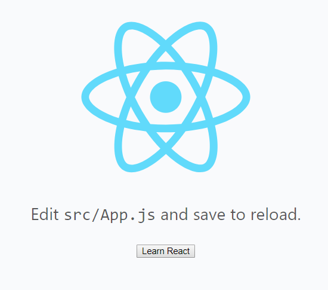

## myapp-purgecss
This is a demo of this problem: https://github.com/FullHuman/purgecss/issues/172

## setup

```base
git clone https://github.com/Lizhooh/myapp-purgecss-demo.git
cd myapp-purgecss-demo
yarn
npm start
```

## issue
purgecss is invalid for antd (https://ant.design)

```js
npm start
```

> Purgecss is not used in development mode


```js
npm run build
npm run serve
```

> Production mode uses purgecss



